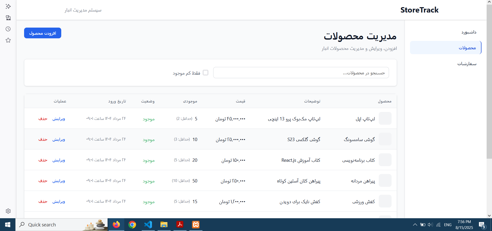
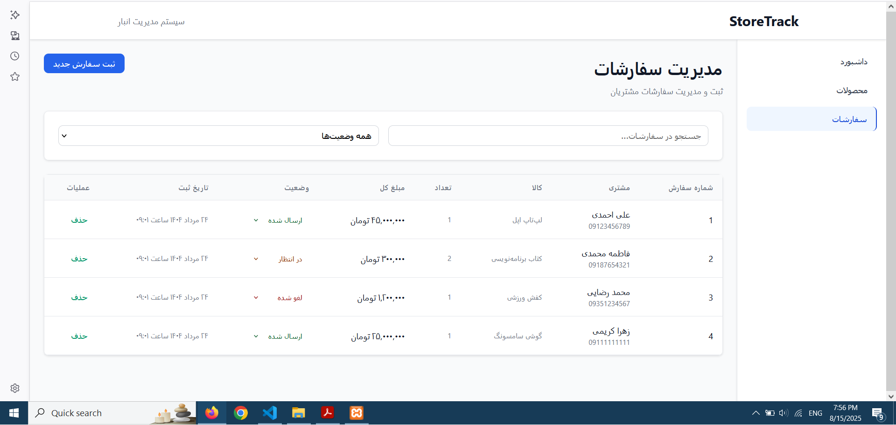
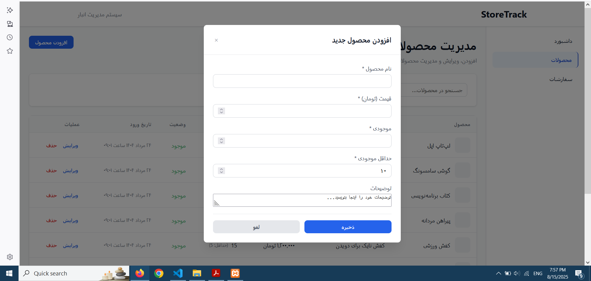

### پیشنیازها
# node.js
# mysql

### نحوه اجرای پروژه

# باز کردن  xampp
# start کردن  Apach , mysql
# ورود به Admin mysql
# ایجاد دیتابیس
#  نوشتن کدهای دیتابیس مانند ایجاد جداول و مقدارهی جداول و ران کردن

## در ترمینال vscode
# cd ./server
# npm i 
# npm start

# Go Live

